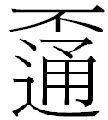

# 臺灣閩南語按呢寫：第 376 期

## 【莫】mài

### 對應華語

甭、別、不要

### 用例

莫去、莫講

### 異用字

勿愛、勿

### 民眾建議

勿

### 用字解析

臺灣閩南語「應該要」是「愛 ài」，「不應該要」是「莫 mài」，「莫 mài」的讀音比「愛 ài」多了一個 m-。

臺灣閩南語有不少副詞，其聲母大多是唇濁塞音（b-）或唇鼻音（m-），可以看出是相對於肯定、以唇濁音或次濁音來表示否定。例如：

肯定否定

ū（有）bô（無）

ē（會）bē（袂/勿會，海口腔為 buē）

ài（愛）mài（莫/勿愛）

thang（通）bâng（）

其他像「毋好 m̄-hó」、「毋是 m̄-sī」、「袂使 bē-sái」、「袂當 bē-tàng」等詞，都可以視為加上唇音 m-和 b-的否定詞。這個現象和古漢語否定詞「不」、「非」、「弗」、「否」、「無」、「毋」等具有唇音聲母，情形類似，但是和現代漢語有所不同，現代漢語是語言變化後丟失唇音的結果。我們試著進行台華語對照，臺灣閩南語的 bô（無）、bē（袂）、mài（莫）、bâng（）分別相當於華語的「沒有、不會、不要、不可以」。在對照中，可見華語都加上「不」而臺灣閩南語為帶有 b-，m-的合音詞，如 bâng 即是「毋通」的合音詞。這些合音詞通常都沒有適當的對應漢字可寫，因此大多採用新造字或訓用的方式來處理。「mài」取「莫」為推薦字而以「勿愛、勿」為異用字，和「bē」取「袂」為推薦字而以「勿會」為異用字一樣，推薦的屬於訓用字，異用字是「台閩字」。這是因為電腦的輸入不容易處理台閩字而容易處理訓用字，才造成如此的選擇。

在「mài」字選擇訓用字的過程中，漢字裡表「禁止、勸阻」等否定詞中，比較適當而常用的有「莫、勿、毋」等三個字。其中，「毋」字已經用來表示臺灣閩南語「m̄」了，例如：「毋是（不是）」。其餘「莫、勿」二字，在古今漢語裡，「勿」字通常用來表示「禁止」，例如：「非禮勿動」、「勿踏草地」；而「莫」字通常用來表示「勸阻」，例如：「莫等閒白了少年頭」、「莫待無花空折枝」。因此，本部推薦「莫」字來表示具「勸阻」義的「mài」，不取「勿」字而以「勿愛」為異用字。

有人建議採用「勿」字來代替「莫」字為推薦字，並且提到「勿」字「國語讀為ㄇㄟ ˊ 音時，義為掃塵，台語則借其音讀作ㄇㄞ ˇ【mài】，為不、不可、不會義。」查「勿」字的本義見於《說文解字》：「勿，州里所建旗。」字形是綁著三條雜色布帛、用來指揮民眾的旗幟，不是用來「掃塵」。用為「禁止」義，亦即用為「不准許」的「不可」義，或「不」、「無」義，是假借用法；而所謂借為「不會」義，或用為「勸阻」義，漢籍經傳相當罕見，不足信。至於其音讀，《廣韻》只有「文弗切」一音，相當於臺灣閩南語文讀音的 bu̍t；《集韻》增一罕見的「莫勃切」，相當於臺灣閩南語文讀音的 bo̍k。這兩個音都無法轉借為 mài，因此用「勿」或「莫」字只是「訓用」關係，不是「借其音」的關係。總之，「勿」字不比「莫」字適當，「莫」字才是適當的推薦用字。

## 【袂】bē/buē

### 對應華語

不、不能、不會

### 用例

袂食袂睏、袂行、袂來

### 異用字

𣍐

### 民眾建議

昧

### 用字解析

臺灣閩南語裡，肯定和否定相對的詞，像「ē/uē」和「bē/buē」、「ài」和「mài」、「thang」和「bâng」等，都以唇音的「b-」或「m-」（b-和 m-屬於同一音位）來表示否定，取代肯定詞的聲母，轉變為否定詞。這也是一種「構詞法」。這種構詞法想要找到適當的漢字來表示，相當不容易。早期的臺灣閩南語曾經分別造了漢字。表列如下：

<table style="border-collapse: collapse; text-align: center;" border="1" cellpadding="6">
  <thead>
    <tr>
      <td rowspan="2">肯定</td>
      <td>音標</td>
      <td>ē/ūē</td>
      <td>ài</td>
      <td>thang</td>
    </tr>
    <tr>
      <td>漢字</td>
      <td>會</td>
      <td>愛</td>
      <td>通</td>
    </tr>
  </thead>
  <tbody>
    <tr>
      <td rowspan="2">否定</td>
      <td>音標</td>
      <td>bē/buē</td>
      <td>mà</td>
      <td>bâng</td>
    </tr>
    <tr>
      <td>漢字</td>
      <td>毋會</td>
      <td>毋愛</td>
      <td></td>
    </tr>
  </tbody>
</table>

文字是語言的紀錄，這些漢字在表示肯定的字上面加上否定的字形，以合體的方式呈現。這當然是合理的辦法，也是漢字發展的方向，猶如華語的「不用」為「甭」、「不要」為「嫑」、「不好」為「孬」，都運用「會意」造字法。但是，造出來的這些台閩字，很難以電腦輸出輸入，因此，教育部推薦用字採用「假借」法，借用「袂」來表示。以「袂」代「勿會」的做法，是相當有社會基礎的；同時「袂」字的「衣袖」義不用於臺灣閩南語，不會造成語文理解的困難，因此在假借法中，是個比較好的用字。

有人建議採用「昧」字來表記「bē/buē」，以為「昧，有糊塗、昏暗不明、不了解等意思，閩南語的讀音與語意皆較符合傳統漢語音韻及字義。」這個說法略有見地，但是不完全符合事實。「昧」的本義見於《說文•日部》：「昧，昧爽，旦明也。从日，未聲。」「旦明」是清晨天剛亮的時候，而「昏暗」義應該是「引申義」，《廣韻•對韻》「莫佩切」下：「昧，暗昧。」正是。而應該指出的是：「昧」不是「黑暗」，是「略有光線，不夠明亮」的意思，因此語義並不相合。至於讀音，據前引「莫配切」，相當於臺灣閩南語文讀音的「muē」，《廈門音新字典》作「muī」，《彙音寶鑑》讀為「buē」，以海口腔而言，和訓釋為「不會」的「buē」相合；但是，以通行腔和內埔腔而言，和訓釋為「不會」的「bē」不相合。整個說來，這個建議 ── 假借為「昧」並不比假借為「袂」更適當。
